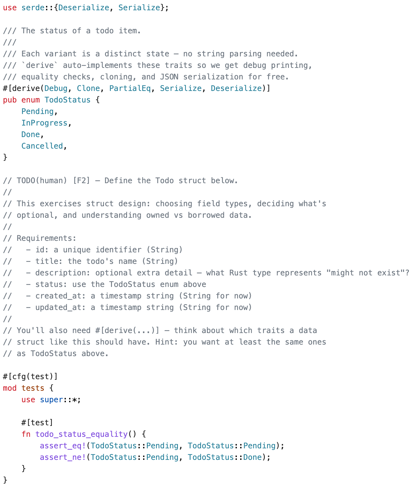
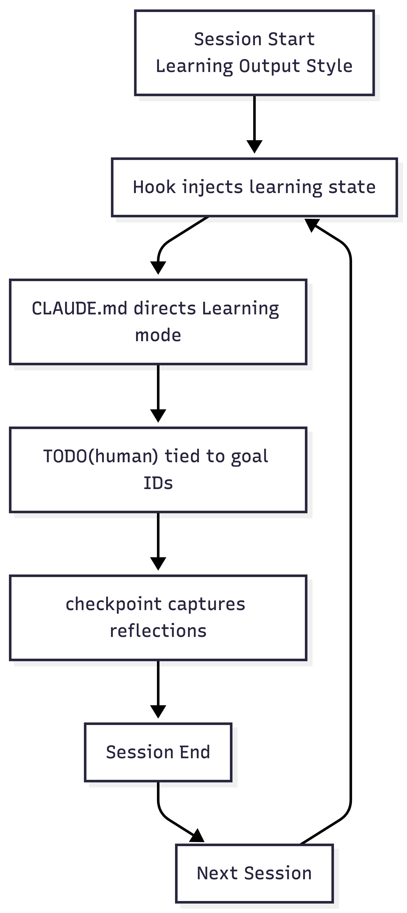
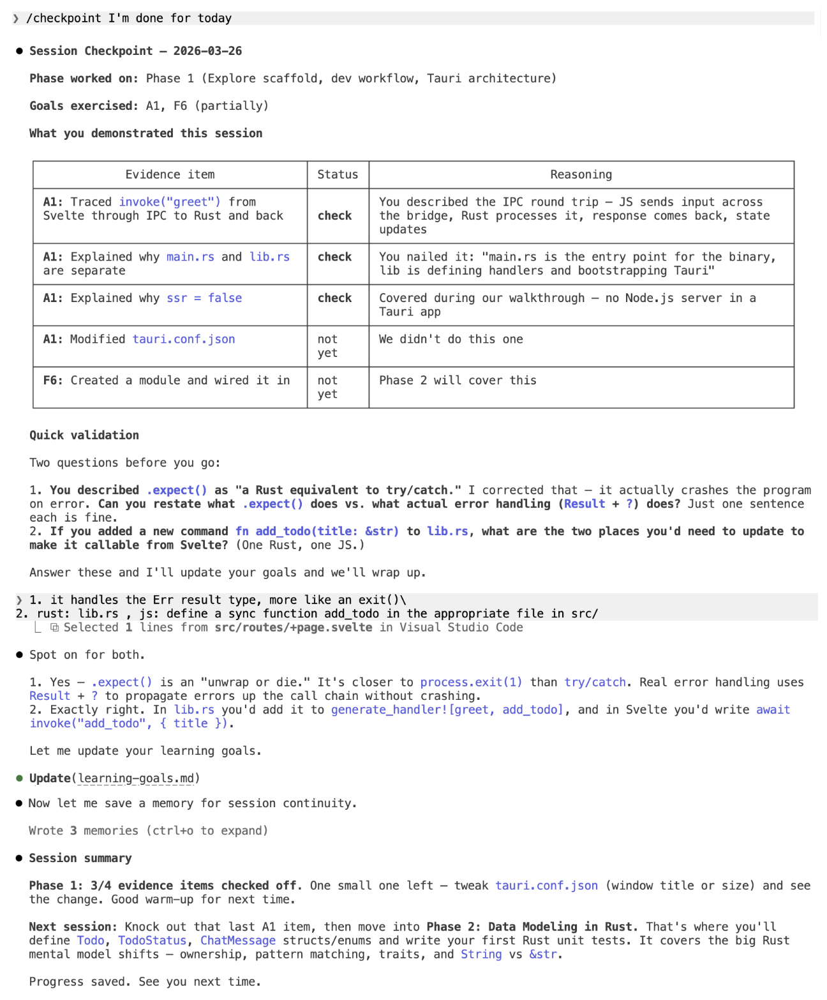

# NatLang Todo

**Learn Tauri 2 + Svelte 5 + Rust by building a natural-language todo app — guided by AI that teaches instead of just writing code.**

No buttons. No checkboxes. No forms. You type what you want, a local LLM figures out your intent, and Rust makes it happen.

> This project is the companion repo for [When Your AI Coding Tool Becomes Your Teacher](https://writing.alteredcraft.com/) on the AlteredCraft Substack.

---

## What You'll Build

A desktop todo app where the **only interface is a chat window**. You type natural language, and the app handles the rest:

```
┌──────────────────────────────────────────────────────┐
│                    NatLang Todo                      │
├────────────────────────────┬─────────────────────────┤
│                            │                         │
│       Chat Panel           │    Todo Dashboard       │
│                            │                         │
│  ┌──────────────────────┐  │  ┌───────────────────┐  │
│  │ assistant: Added     │  │  │ Pending (3)       │  │
│  │ "buy milk" to your   │  │  │ ☐ buy milk        │  │
│  │ todos.               │  │  │ ☐ call dentist    │  │
│  │                      │  │  │ ☐ finish report   │  │
│  │ user: mark milk done │  │  │                   │  │
│  │                      │  │  │ Done (2)          │  │
│  │ assistant: Done!     │  │  │ ☑ groceries       │  │
│  │ "buy milk" is now    │  │  │ ☑ email boss      │  │
│  │ complete.            │  │  │                   │  │
│  └──────────────────────┘  │  └───────────────────┘  │
│  ┌──────────────────────┐  │                         │
│  │ Type a message...    │  │  3 pending · 2 done     │
│  └──────────────────────┘  │                         │
└────────────────────────────┴─────────────────────────┘
```

Under the hood:

1. Svelte sends your message to Rust via Tauri IPC
2. Rust forwards it to a local LLM (Ollama) for intent classification
3. The LLM returns structured JSON — `{ "intent": "add", "title": "buy milk" }`
4. Rust parses the intent and executes against SQLite
5. A Tauri event fires, and the Svelte dashboard updates reactively

Traditional todo apps put 90% of logic in the frontend. This design inverts it — **70% of the interesting work happens in Rust** (LLM orchestration, intent parsing, database ops, error handling, event emission). You spend your time where the learning goals are.

---

## This Is Not a Tutorial

This is a **learning framework** that reconfigures [Claude Code](https://claude.ai/code) into a teaching system.

When you open this project in Claude Code, it activates [Learning output style](https://code.claude.com/docs/en/output-styles) — a mode where AI writes the surrounding code but leaves strategic gaps marked `TODO(human)` for you to implement. Each gap is tied to a specific learning goal, so you're always building understanding, not just building software.

Here's what that looks like. When defining the core data model, Claude creates the file structure and context, then marks the spot where **you** make the decisions:

<p align="center">
  
</p>

The agent didn't just leave a blank. It listed the fields you need, posed the conceptual question ("what Rust type represents 'might not exist'?"), and hinted at which traits the struct needs. You decide. You think about `Option<T>`. That's where learning happens.

### The Four Layers

The framework chains four mechanisms into a continuous learning loop:

<p align="center">
  
</p>

**1. Learning output style** — `TODO(human)` markers at decision points, with Insight blocks explaining concepts in context. Claude writes scaffolding; you write the meaningful code.

**2. CLAUDE.md as curriculum** — Directs Claude to tie every assignment to your current phase and learning goals. Encodes validation techniques: explain-back ("why did you use `&self` here?"), predict-then-verify ("what will `cargo test` show?"), and transfer ("modify this to exercise the same concept differently").

**3. SessionStart hook** — Fires when you open Claude Code, injecting your current build phase and unchecked goals. You never re-explain your progress. Continuity is automatic.

**4. /checkpoint skill** — Run at the end of each session. Maps your git changes to learning goals, asks targeted reflection questions, and updates your progress in `learning-goals.md`.

Here's a checkpoint in action — the agent maps recent changes to goals, checks off evidence items, and validates understanding before updating the record:

<p align="center">
  
</p>

---

## Quick Start

### Prerequisites

| Tool | Install |
|------|---------|
| **Rust toolchain** | [rustup.rs](https://rustup.rs) |
| **Node.js 18+** | [nodejs.org](https://nodejs.org) |
| **pnpm** | `npm install -g pnpm` |
| **Ollama** | [ollama.com](https://ollama.com) — then `ollama pull llama3.2:3b` |
| **Claude Code** | [claude.ai/code](https://claude.ai/code) (Pro or Team subscription) |
| **Tauri prerequisites** | [Platform-specific requirements](https://v2.tauri.app/start/prerequisites/) |

### Get Started

```bash
# 1. Fork and clone
git clone https://github.com/AlteredCraft/learn-tauri.git
cd learn-tauri

# 2. Install dependencies
pnpm install

# 3. Configure LLM (defaults work with Ollama)
cp .env.example .env

# 4. Verify Ollama is running
ollama pull llama3.2:3b

# 5. Open in Claude Code
claude

# 6. Verify the scaffold builds
pnpm tauri dev
```

The app window should open with "NatLang Todo" in the title bar and a working demo command. Phase 1 starts here — exploring and understanding the scaffold, not creating it from scratch.

> **First compile takes 3-5 minutes** while Rust downloads and compiles dependencies. Subsequent runs use incremental compilation and are much faster.

### What Happens Next

Read `docs/phases/phase-01.md` for your first assignment. The SessionStart hook will show your current phase and goals automatically. Work through all 10 phases to build the complete app:

| Phase | What You Build | What You Learn |
|-------|---------------|----------------|
| 1 | Explore scaffold, run dev workflow | Tauri architecture, Rust modules |
| 2 | Data model — structs, enums, tests | Ownership, borrowing, pattern matching |
| 3 | SQLite persistence — CRUD + tests | Error handling with `Result` and `?` |
| 4 | Tauri commands — wire DB to frontend | IPC bridge, managed state |
| 5 | Chat UI — split-panel Svelte | Svelte 5 runes, component architecture |
| 6 | Tauri events — reactive dashboard | Backend-to-frontend push |
| 7 | LLM client — HTTP to Ollama | Async Rust, serde, reqwest |
| 8 | NL pipeline — intent classification | Prompt engineering, pattern matching |
| 9 | Polish — chat history, cleanup | Reactive state, component refinement |
| 10 | Multi-provider — OpenAI-compatible | Traits, abstraction in Rust |

---

## Project Structure

```
├── CLAUDE.md              ← Curriculum directives for Learning mode
├── learning-goals.md      ← Your learning progress (7 foundational + 11 applied goals)
├── spec.md                ← Product specification
├── .claude/
│   ├── settings.json      ← Learning output style + hooks config
│   └── skills/
│       ├── checkpoint/    ← End-of-session reflection
│       ├── verify/        ← Run clippy + tests + checks
│       ├── preflight/     ← Check prerequisites are installed
│       ├── project-overview/ ← Orientation: what you're building + why
│       └── docs/          ← Validated documentation link lookup
├── .env.example           ← LLM provider config
├── src/                   ← Svelte 5 frontend (pre-scaffolded)
├── src-tauri/             ← Rust backend (pre-scaffolded)
└── docs/
    ├── architecture.md    ← System architecture diagram
    ├── llm-setup.md       ← Ollama installation guide
    └── phases/            ← Per-phase briefing docs (phase-01 → phase-10)
```

### Architecture

```
┌─────────────────────────────────────────────────────────┐
│                     Tauri Window                        │
│                                                         │
│  ┌────────────────────────┐  ┌─────────────────────────┐│
│  │   Chat Panel (Svelte)  │  │ Todo Dashboard (Svelte) ││
│  │                        │  │                         ││
│  │  invoke("send_message")│  │  listen("todos-updated")││
│  └───────────┬────────────┘  └───────────▲─────────────┘│
│              │        Tauri IPC          │              │
│              ▼                           │              │
│  ┌─────────────────────────────────────────────────────┐│
│  │              Rust Backend                           ││
│  │  Commands → LLM Client → Intent Parser → SQLite     ││
│  │                    ↓                                ││
│  │             emit("todos-updated")                   ││
│  └─────────────────────────────────────────────────────┘│
└─────────────────────────────────────────────────────────┘
```

---

## Adapt It For Your Stack

The learning framework is applied here to Tauri, but the pattern is stack-agnostic. Everything that powers the learning experience is natural language — markdown directives, JSON config, and skill definitions. No custom code.

Want to learn **Go by building a CLI tool**? Or **Elixir by building a Phoenix app**? Replace the learning goals, adjust the phase docs, point documentation references at your stack. The structure carries over:

- `CLAUDE.md` as curriculum (directs the Learning output style)
- `learning-goals.md` with observable evidence items
- SessionStart hook for session continuity
- `/checkpoint` skill for structured reflection

A technical educator could fork this and adapt it without writing a line of Rust.

---

## FAQ

**Can I use a different LLM?**
Yes. Set `LLM_PROVIDER=openai-compatible` in `.env` and configure the base URL and API key. Ollama is the default because it's free and local.

**What if I'm stuck?**
Each phase doc has expandable hints. You can also ask Claude Code to explain a concept without generating code — it'll reference the relevant learning goal.

**Do I need to know Svelte?**
Basic web dev knowledge is enough. Svelte 5 specifics (runes, component patterns) are covered in the learning goals. Claude Code will draw comparisons to React/Vue if that helps.

**Do I need to know Rust?**
No. The curriculum starts from zero Rust knowledge. It assumes you're an experienced web developer (Python/JavaScript) picking up Rust for the first time.

**How is this different from a tutorial?**
Tutorials give you all the code. This gives you the context and lets you write the code. The framework verifies understanding through explain-back, predict-then-verify, and transfer exercises — not just "did it compile."

---

## Read the Full Story

This project is the hands-on companion to **[When Your AI Coding Tool Becomes Your Teacher](https://writing.alteredcraft.com/)**, which covers the research behind the approach, lessons from building and testing the framework, and why AI-assisted learning works when you design the right constraints.

---

<p align="center">
  <a href="https://alteredcraft.com/"><strong>Altered Craft</strong></a> helps developers navigate AI transformation through practical technical exploration.
</p>

---

## License

MIT
